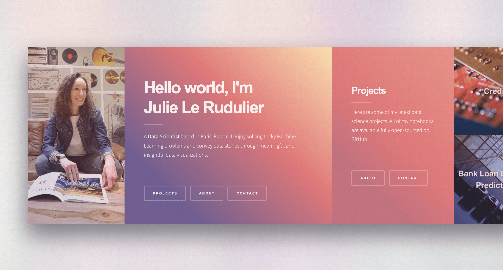

 
<h1>Hello world, I'm Julie Le Rudulier!</h1> 
I'm a <b>Data Scientist</b> based in Paris, France. 🥐 ☕

I enjoy solving tricky Machine Learning problems and convey data stories through meaningful and insightful data visualizations.

Let's work together!
   

---
 ### ✍ Contact

<h4>LinkedIn Profile</h4>

 
<h4>Portfolio</h4>

 

---
### 💻 Programming Languages and Platforms
 

        
     

